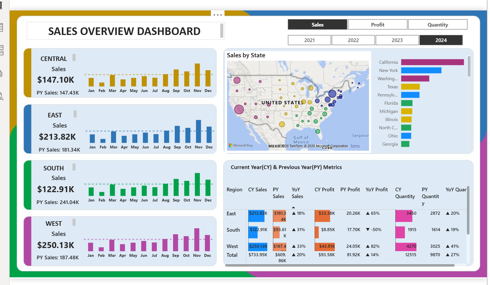

# 📊 Sales Overview Dashboard

## 📌 Project Overview

This project is a **Sales Overview Dashboard** built using SQL and Power BI to analyze business performance and generate actionable insights.
The dashboard helps in tracking key metrics like sales, profit, and regional performance for better decision-making.

---

## 🎯 Business Problem

Businesses often struggle to track their sales performance across different regions, products, and time periods.
This project solves that problem by providing a **visual and interactive dashboard** to monitor and analyze sales data efficiently.

---

## 🛠️ Tools & Technologies Used

* SQL (Data Extraction & Transformation)
* Power BI (Data Visualization & Dashboard)
* Excel / CSV (Dataset)

---

## 📊 Dashboard Preview

---

## 📈 Key Insights

* 💰 Total Sales and Profit Overview
* 🌍 Region-wise Sales Performance
* 📦 Category & Product Analysis
* 📅 Monthly & Yearly Sales Trends
* 🏆 Top Performing Products

---

## 📂 Project Files

* `Sales_Dashboard.pbix` → Power BI Dashboard File
* `dataset.csv` → Dataset used for analysis
* `dashboard.png` → Dashboard Preview Image

---

## ⚙️ Process Workflow

1. Collected raw sales data (CSV/Excel)
2. Used SQL for data cleaning and transformation
3. Imported cleaned data into Power BI
4. Created interactive visuals and KPIs
5. Designed a user-friendly dashboard layout

---

## 🚀 How to Use

1. Download the `.pbix` file
2. Open it in Power BI Desktop
3. Explore the dashboard and interact with filters

---

## ⭐ Key Features

* Interactive Dashboard
* Clean and Professional UI
* Data-driven Insights
* Easy to Understand Visuals

---

## 📌 Conclusion

This project demonstrates how SQL and Power BI can be combined to transform raw data into meaningful insights, helping businesses make better decisions.

---

## 🙌 Connect

If you like this project, feel free to ⭐ the repository!

